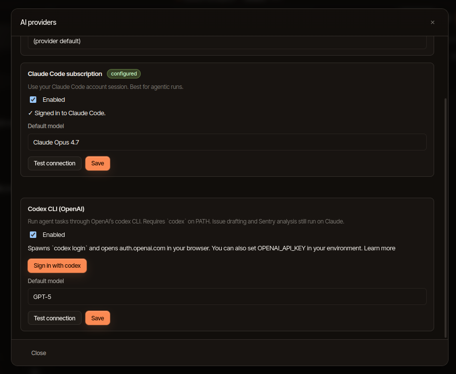
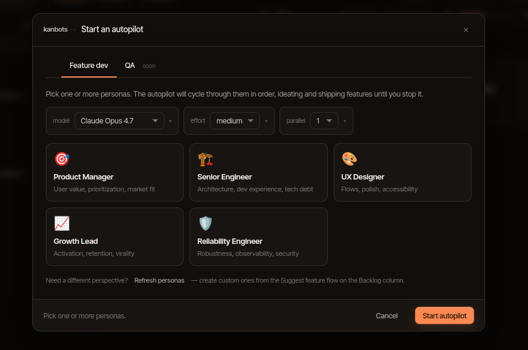
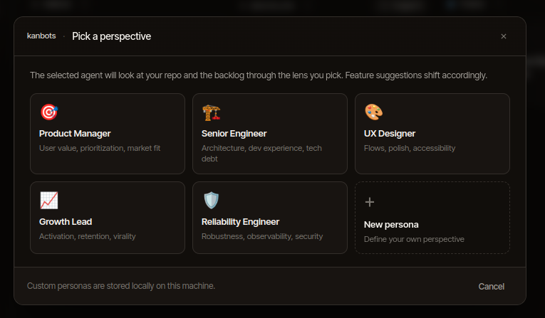

# Agents

kanbots dispatches one **agent run** per issue, in an isolated git worktree,
backed by either **Claude Code** (`claude -p`) or **Codex** (`codex exec`).
This page describes that lifecycle in detail.

## What runs

Two CLI agents are supported, behind a single
`AgentCliAdapter` interface (`packages/dispatcher/src/`). The adapter
encapsulates argument construction, stream parsing, and decision
plumbing — the rest of the dispatcher doesn't care which CLI is
underneath.

| Agent | Invocation | Notes |
| --- | --- | --- |
| Claude Code | `claude -p` | Reuses your `claude /login` credentials. Best default. |
| Codex | `codex exec` | Requires `codex` on `PATH`. Sign in via "Sign in with codex" or `OPENAI_API_KEY`. Issue drafting and Sentry analysis still run on Claude. |

You pick which one to use per dispatch from the **AI providers** modal:



Settings → AI providers also sets the workspace default — `claude
(auto)` uses whichever CLI is enabled and signed in.

The Claude flags used are roughly:

```
claude -p \
  --output-format stream-json \
  --verbose \
  --permission-mode bypassPermissions \
  --append-system-prompt "<issue context>" \
  --model <chosen model> \
  [--resume <sessionId>] \
  [--mcp-config <path>]
```

`--permission-mode bypassPermissions` is what makes runs hands-off —
the agent is allowed to use any tool without prompting per call.
Containment is enforced separately (see below) and a pre-push hook in
the worktree prevents network pushes regardless. Codex's equivalent
flags are configured by its adapter in the same place.

## Worktree lifecycle

For each run kanbots:

1. Creates a worktree at `.kanbots/worktrees/issue-<n>-<runId>/`.
2. Branches from the repo's default branch as
   `kanbots/issue-<n>-<runId>`.
3. Stamps an identity file (`.kanbots-identity.json`) used to
   recover orphaned runs.
4. Installs a `pre-push` hook that exits non-zero — any push attempted
   from inside the worktree fails.
5. Spawns the Claude process as a detached process group leader (POSIX)
   so it can be killed cleanly with SIGTERM → SIGKILL escalation.

When the run ends, the worktree stays on disk until you promote it,
discard it, or run another action that removes it. Worktrees and their
branches are first-class kanbots state — you can have many parked runs
across many issues.

## The stream

Both CLIs emit one JSON object per line (Claude's `stream-json` and Codex's
equivalent). The dispatcher's
[`stream-parser`](../packages/dispatcher/src/stream-parser.ts) classifies
each line into one of:

| Event | Meaning |
| --- | --- |
| `text` | Assistant message text |
| `tool_use` | Tool call (Read, Edit, Bash, …) |
| `tool_result` | Tool result body |
| `session` | Session id (used to resume runs) |
| `decision` | Pending decision prompt — the run pauses |
| `result` | End of run, with success/failure and cost |
| `rate_limit` | Provider rate-limit signal — see [cooldown](#rate-limits) |
| `parse_error` | A line we couldn't parse |

Events are persisted into the `agent_events` table and broadcast over the
`agent-runs:events:subscribe` IPC channel. The UI replays from the table
on reconnect, so the live thread survives a renderer reload.

## Decision prompts


When the agent emits a `decision` event, the dispatcher:

1. Marks the run's card as `awaiting_input`.
2. Stores the question and option list on the card.
3. Stops feeding stdin — the agent process waits.
4. Pushes a `DecisionPayload` (`{ question, options: [{ value, label }] }`)
   to the UI.

You answer it in the issue detail modal. The handler `cards:resolve`
writes the choice back into the agent's stdin and the run continues.
If you close the app mid-decision, the state is on the card — reopen
and respond.

## Containment

Either CLI can technically `Edit` or `Write` to any path the user can
access. kanbots watches every `tool_use` and compares the target path
to the worktree root. Behaviour is governed by **containment mode**:

| Mode | Effect on out-of-worktree edits |
| --- | --- |
| `off` | Allowed, no surface |
| `warn` (default) | Logged as a warning event in the thread |
| `pause` | Run pauses with a decision; you choose to allow or stop |

Set it per-workspace with `containmentMode` in `.kanbots/config.json`, or
per-process via `KANBOTS_CONTAINMENT_MODE=pause` (etc.) in the
environment.

## Cost budgets

Every `result` event carries a USD cost (both CLIs report it). The
dispatcher accumulates it into:

- **Per-run cost** — visible on the run card.
- **Per-session cost** — when run under autopilot.

Two budgets, both optional:

```jsonc
// .kanbots/config.json
{
  "defaults": {
    "runCostBudgetUsd": 2.50,        // single run cap
    "sessionCostBudgetUsd": 25.00    // autopilot session cap
  }
}
```

Setting either to `null` (or omitting it) disables that cap. When a cap
is hit the run is stopped with `stopReason: 'cost-budget'`.

## Rate limits

The streams surface rate-limit hits explicitly. When the dispatcher
detects one it broadcasts a `cooldown:changed` event with the resume
time. The UI shows a banner and queues new dispatches until the
cooldown clears.

## Resuming a run

Each invocation produces a session id (in the `session` event). The
dispatcher persists it on the run row; on resume, the next process is
spawned with the CLI's resume flag (`--resume <sessionId>` for Claude;
the Codex equivalent for Codex) so context is reused without
re-sending the full history.

## Promotion

When a run finishes you have three ways to land its work:

| Action | What it does |
| --- | --- |
| **Promote commit** | Stages the tip of the worktree's branch and merges/cherry-picks onto the active branch in your main checkout. Worktree is removed. |
| **Open draft PR** | (GitHub mode only) Pushes the branch to `origin` and opens a draft PR via Octokit. Worktree stays. |
| **Reveal worktree** | Opens the worktree path in your file manager so you can inspect or hand-edit before promoting. |
| **Discard** | Stops the run if active, removes the worktree, deletes the branch. |

Promotion is the **only** path through which agent commits reach your
real branches. Even with `bypassPermissions`, the pre-push hook
guarantees the agent itself never publishes anything.

## Autopilot

Autopilot is the higher-level orchestrator: instead of one click → one
run, you set a goal and a budget and walk away. Two kinds:

### `feature-dev` — self-evolving, parallel



The signature mode. You pick a roster of personas (e.g. product
author, engineer, reviewer, tester) and a parallelism count (1–4).
The orchestrator:

1. Spawns up to **N parallel slots** (capped at 4 by `MAX_PARALLELISM`).
2. Each slot atomically claims **the next persona** from a round-robin
   counter (`cycle_index`).
3. Each persona's child run is dispatched against the parent issue
   inside its own worktree.
4. Personas can **split the issue into subtasks** as they go —
   `splitIssue` creates child cards on the board, and later cycles
   pick them up.
5. The loop continues until you stop it, the session cost budget is
   hit, or a persona signals completion.

This is what "self-evolving with parallel task creation and execution"
means in practice: agents discover what's missing, file new cards for
it, and other slots execute those new cards in parallel — the backlog
grows and shrinks under the orchestrator without you intervening.

### `qa` — autonomous fix loop

Configurable check commands plus optional dev-server watching:

- Runs each `AutopilotCheckCommand` (typecheck / tests / lint / build /
  e2e) in the worktree.
- Optionally starts your dev server and watches for live-UI failures.
- For every failing check, dispatches a fix run on a derived child
  issue.
- Re-runs checks until everything passes or the budget is hit.

### Configuration

```ts
type AutopilotKind = 'feature-dev' | 'qa';
type AutopilotEffort = 'low' | 'medium' | 'high' | 'xhigh' | 'max';

interface FeatureDevConfig {
  kind: 'feature-dev';
  personas: AutopilotPersonaSnapshot[];
  model?: string;
  effort?: AutopilotEffort;
  parallelism?: number;            // 1–4; clamped, default 1
  sessionCostBudgetUsd?: number;
}

interface QaConfig {
  kind: 'qa';
  checks: AutopilotCheckCommand[];
  liveUi: boolean;
  devServer?: { command: string; args: string[] };
  sessionCostBudgetUsd?: number;
}
```

Effort maps to model selection and tool budget — `low` keeps to cheap
models with tight context; `max` lets the run think for a long time.

Sessions, child runs, and cycle bookkeeping all live in the
`autopilot_sessions` table. Stopping the parent stops all children;
in-flight children finish their current iteration but no new child
runs are started.

## Personas

A persona is a named system prompt snippet. Each one biases the agent
toward a particular lens (Product Manager, Senior Engineer, UX
Designer, Growth Lead, Reliability Engineer, …) — feature
suggestions, code reviews, and split decisions shift accordingly.



Personas are stored locally (in the SQLite db). Built-in ones ship
with kanbots; **New persona** lets you write your own — define the
prompt, save, reuse forever. Custom personas never leave your machine.

In one-off dispatches the chosen persona is applied via
`--append-system-prompt`; in an autopilot feature-dev session the
roster is the round-robin source for parallel slots.

## Files of interest

- `packages/dispatcher/src/worker.ts` — the spawn / stream loop
- `packages/dispatcher/src/stream-parser.ts` — line classification
- `packages/dispatcher/src/worktree.ts` — `git worktree` wrapper
- `packages/dispatcher/src/containment.ts` — path-scope guard
- `packages/api/src/agent-runs/` — handlers for dispatch/stop/promote
- `packages/api/src/autopilot/` — session orchestration
