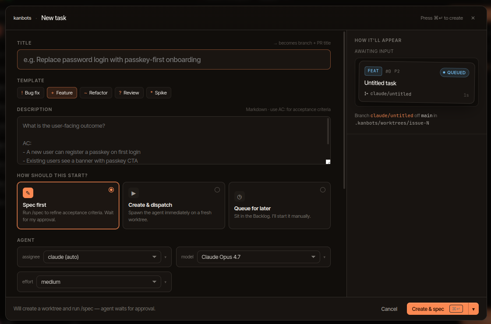
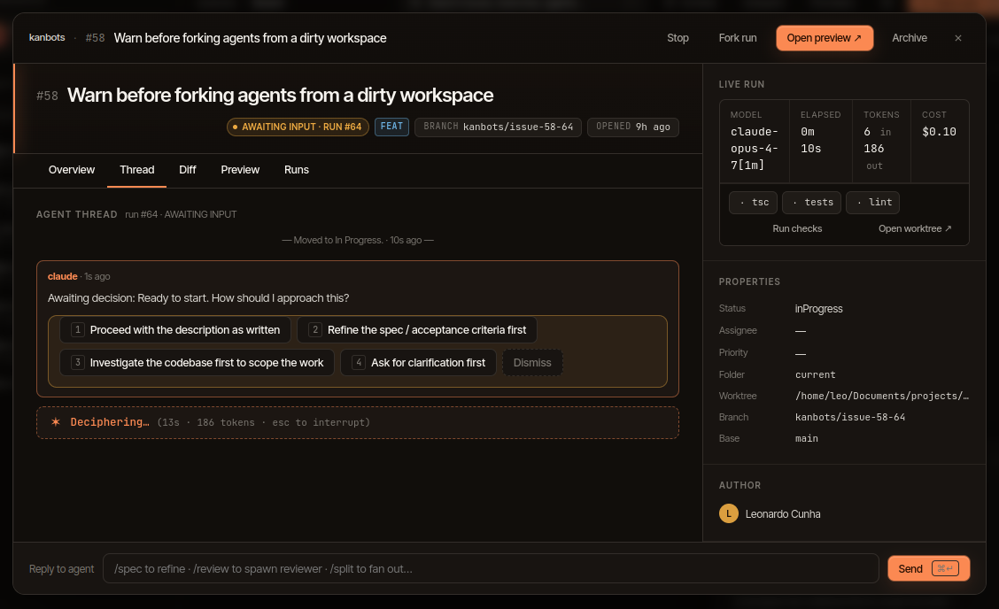

# Getting started

This walks through installing kanbots, opening your first workspace, and
dispatching an agent run.

## 1. Prerequisites

| Requirement | Why |
| --- | --- |
| **Node 20+** | Electron main process and tooling |
| **pnpm 10+** | Workspace manager (the repo is a pnpm monorepo) |
| **`git`** | Worktree creation, branch ops |
| **`claude`** on `PATH` | The Claude Code CLI — used for agent runs. Install from <https://docs.claude.com/en/docs/claude-code> and run `claude /login` once. |
| **`codex`** on `PATH` | (Optional) Codex CLI — alternative agent runtime. |
| **`gh`** | (Optional) Simplest way to authenticate GitHub mode. |

You need **at least one** of `claude` or `codex` on your `PATH` for
agents to run. If neither responds to `which`, the Dispatch button
will fail. Sign in with `claude /login` (or the Codex equivalent)
ahead of first dispatch — kanbots inherits the environment of the
process that launches it.

## 2. Install and launch

```sh
git clone https://github.com/leodavinci1/kanbots
cd kanbots
pnpm install
pnpm desktop          # build everything, open Electron
```

For development with hot-reload:

```sh
pnpm desktop:dev
```

That runs Vite (web), `tsup --watch` (Electron main + preload), and
`electronmon` against the renderer URL — three coloured streams in one
terminal.

## 3. Picking a workspace

The first window is a workspace picker. Browse to any folder that contains
a git repository and click **Open**. kanbots will:

1. Resolve the git toplevel via `git rev-parse --show-toplevel`.
2. Create `.kanbots/` next to it (`db.sqlite`, `worktrees/`,
   `config.json`).
3. Detect whether the repo has a GitHub remote (`origin`). If yes, the
   picker offers **GitHub mode**; if no, it falls back to **Local mode**.

You can revisit and switch modes later from the workspace settings.

## 4. What gets written to disk

```
<your-repo>/
└── .kanbots/
    ├── db.sqlite              # everything: issues, runs, threads, providers
    ├── db.sqlite-wal          # WAL journal (better-sqlite3)
    ├── db.sqlite-shm          # shared memory
    ├── config.json            # workspace mode + defaults
    ├── worktrees/             # per-run git worktrees
    │   └── issue-42-7/
    ├── attachments/           # files dragged into chats / cards
    ├── mcp-runtime/           # transient MCP configs handed to claude
    └── promote/               # staging when promoting a worktree
```

`db.sqlite` is the source of truth for everything except the source code
itself. Add `.kanbots/` to `.gitignore` unless you have a reason not to —
the app prompts to do this on first open.

Nothing is written outside the workspace folder.

## 5. The first card

Click **+ New task** in the top right. Pick a template (Bug fix,
Feature, Refactor, Review, Spike), write a description, and choose how
the card should start:

- **Spec first** — runs `/spec` on a fresh worktree and waits for your
  approval on the refined acceptance criteria before any
  implementation work.
- **Create & dispatch** — spawns an agent immediately on a fresh
  worktree.
- **Queue for later** — sits in Backlog; you start it manually.

Pick which agent CLI handles the run (`claude (auto)` defaults to
Claude Code; switch to Codex per dispatch), the model, and the
effort.



*The right rail previews how the card will appear on the board,
including the worktree branch (`kanbots/issue-N`) it'll create.*

In **Local mode**, the card lands as a row in `local_issues`.
In **GitHub mode**, it's posted as a real issue on the repo.

Drag a card between columns to change its status. In GitHub mode the
move is reflected as `status:*` label edits on the issue.

## 6. Your first agent run

1. Open a card, click **Dispatch**.
2. Pick an agent identity (Claude Code or Codex) and a model. Confirm.
3. kanbots creates `.kanbots/worktrees/issue-<n>-<runId>/`, branches it
   from your default branch, and spawns the chosen CLI against it.
4. The detail panel switches to the live thread. Every `tool_use` and
   `tool_result` streams in.
5. If the agent asks for permission, a decision card appears. Click an
   option; the run resumes with that choice.
6. When the run finishes:
   - **Branch preview** starts the worktree's dev server (whatever your
     `package.json` `dev` script does) and shows you the URL.
   - **Promote commit** rebases the worktree's tip onto your branch.
   - **Open draft PR** (GitHub mode only) pushes and opens a draft.
   - **Discard** removes the worktree and branch.

A pre-push hook is installed in every worktree, so even if the agent
runs `git push`, it will fail. Promotion is always an explicit user
step.



*Anatomy of a run: header (Stop / Fork run / Open preview / Archive),
the live agent thread on the left, run stats and worktree info on the
right, slash-command-aware reply box at the bottom.*

## 7. Try parallel + autopilot

Once one run feels right, scale up:

- **Parallel runs across the board** — dispatch on multiple cards at
  once. Each agent gets its own worktree and runs independently;
  watch the board light up.
- **Autopilot on a single issue** — open a card, click **Autopilot**,
  pick personas + parallelism (up to 4). Slots round-robin through
  personas; agents split the issue into subtasks and the orchestrator
  walks through them until you stop or the cost budget hits.

See [agents.md → Autopilot](agents.md#autopilot) for the full
configuration.

## 8. Next steps

- Set up GitHub auth properly: [issues.md](issues.md#github-mode)
- Wire the MCP server into Cursor: [mcp-server.md](mcp-server.md)
- Set per-run cost budgets: [configuration.md](configuration.md#cost-budgets)
