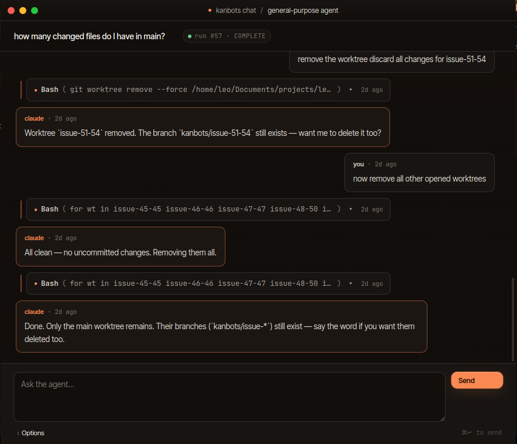

# AI providers

The **AI providers** modal (Settings → Providers) is where you pick
which CLI runs your agents and what model they default to. Two
providers carry agent runs; the rest are HTTP-only backends used by
the chat panel and a few drafting/analysis flows.

## Agent CLIs

| Provider | What it does | How to authenticate |
| --- | --- | --- |
| **Claude Code subscription** | Runs agents through your existing Claude Code session. The default; best for agentic runs. | `claude /login` once. Kanbots inherits your CLI session. |
| **Codex CLI (OpenAI)** | Runs agent tasks through OpenAI's `codex` CLI. Requires `codex` on `PATH`. | Click **Sign in with codex** (spawns `codex login` and opens auth.openai.com), or set `OPENAI_API_KEY` in your environment. |

Per dispatch you can route to either — when you set the assignee to
`claude (auto)`, kanbots uses whichever CLI is enabled and signed in.

> Even when Codex is your default, **issue drafting and Sentry
> analysis still run on Claude.** Those are short-form prompts where
> Claude's output format is currently what kanbots expects.

## Chat-only providers

The chat panel (a separate surface from the kanban) and a couple of
drafting flows can talk to HTTP-only backends. The full set of
provider IDs in the codebase:

| `id` | Vendor | Use |
| --- | --- | --- |
| `claude-code` | Anthropic via `claude` CLI | Agents + chat |
| `openai` | OpenAI API (Codex CLI maps here) | Agents (Codex) + chat |
| `anthropic` | Anthropic API | Chat |
| `google` | Gemini API | Chat |
| `deepseek` | DeepSeek API | Chat |
| `xai` | xAI (Grok) | Chat |

*The chat panel runs alongside the board — handy for one-off questions
("how many changed files do I have in main?", "remove the worktree
discard all changes for issue-51-54") that don't deserve a card.*

## Where keys live

- All provider configs and API keys are persisted in the `providers`
  table inside `.kanbots/db.sqlite`.
- Keys are encrypted with Electron `safeStorage.encryptString()` when
  available, plaintext fallback otherwise. Each row records
  `keyEncryption: 'safe' | 'plain'` so you can tell which.
- If `ANTHROPIC_API_KEY` / `OPENAI_API_KEY` / `GOOGLE_API_KEY` /
  `DEEPSEEK_API_KEY` / `XAI_API_KEY` are set in your environment on
  first run, kanbots imports them once and then forgets them.
- Keys never leave the workspace folder. They are not synced or
  pushed even if you commit `.kanbots/`.

## Login gates

Two non-dismissible gates can appear:

- **No agent provider configured** — appears when neither Claude
  Code nor Codex is enabled and signed in. Set up at least one before
  you can dispatch.
- **`claude` not signed in** — appears when an agent dispatch fails
  because the Claude CLI can't authenticate. Run `claude /login`,
  retry.

Both have a Retry button so you don't restart the app after fixing.

## Files of interest

- `packages/local-store/src/repos/providers.ts` — encryption + persistence
- `packages/llm/src/adapters/openai-compatible.ts` — shared OpenAI-style adapter
- `packages/llm/src/manager.ts` — provider routing
- `packages/web/src/components/modals/ProvidersSettingsModal.tsx` — UI
- `packages/web/src/pages/ProvidersOverlay.tsx` — gate
- `packages/web/src/pages/ClaudeLoginGate.tsx` — gate
